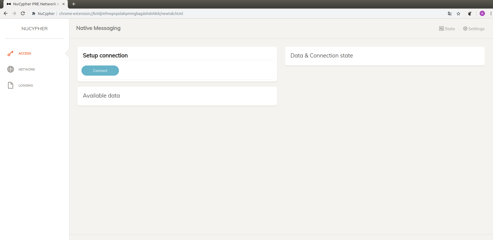
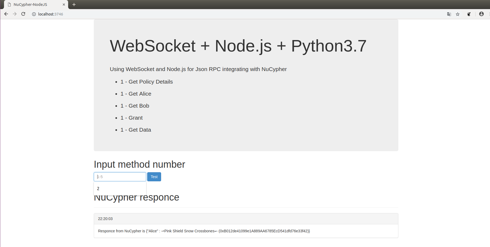

# NuCypher Node.js Library
# Structure

<ol type="1" style="font-size: x-large;">
<li> [Promo Video](#promo)
<li> [About](#about)
<li> [Native Messaging & How it was before](#native-messaging)
<li> [Node.js <> Python3](#node.js<>python3)
<li> [Solution](#solution)
<ol type="a" style="font-size: large;">
  <li> [Installation](#installation)
  <li> [API methods](#methods)
  <li> [Test](#test)
</ol>
<li> [Finally](#finally)
<li> [Contacts](#team)
</ol>

# Promo
You can watch  <a href="https://youtu.be/j44wKitorS8" target="_blank">promo video</a> by link on YouTube: 

# About
**NuCypher** is an HTTPS analog for decentralized applications. Every Hackathon NuCypher encouraged participants interesting challenges and ideas of which may turn out high-quality business-products. But any product should be comfortable for users and requires high-quality frontend. 

At this moment there is no frameworks and libraries for frontend-development, so, Each implementation is sharpened only for the needs of the project and does not represent the full NuCypher functionality.  

On this hackathon I wanna present **node.js API**, which allow develop NuCypher products easier and faster.

# Native Messaging & How it was before

The previous mode of interaction was **Native Messaging**. 

Native Messaging is a Chrome-specific mechanism that allows **Chrome extensions to interact with Native applications**. But this interaction option is not good, as it has a significant drawback which is that **there is no security integration and no documentation on the security model**. Thus, on top of it you need to create an encryption level, which **leads to additional time costs**.

# Node.js <> Python3

My solution is aimed at developing a standardized framework for faster development of the frontend. **Node.js** was used for creating the framework.

**Node.js** is a software platform that turns javascript from a highly specialized language into a general purpose language. The main advantage of Node.js is that the **web server is resource efficient**. For my node.js framework, python scripts are used interacting with them via **websockets**. Data is exchanged using **json**, which is returned from python scripts to the frontend.

# Solution

# Installation

**Requirements:**
1. Python >=3.6
2. Node.js
3. Npm

**For local installation you need to run following commands (from nucypher directory):**
1. pipenv install --dev --three --skip-lock --pre
2. node app.js

**Architecture:** 

1. examples/finnegans-wake-demo/api.py - python3 API
2. app.js - node.js main 
3. public/index.html, public/js/application.js - test frontend
4. run.sh - shell script for start nucypher with node.js at the same time

# API methods

1. Get policy details 
2. Get Alice
3. Get Bob
4. Grant 
5. Get data

Responce examples: 

- **Get Alice** - Responce from NuCypher is {"Alice" : ⇀Pink Shield Snow Crossbones↽ (0xB012de41099e1A889AA6785EcD541dfd76e33f42)}
- **Get policy details** - {"policy_end_datetime" : Mon, 21 Jan 2019 19:25:13 GMT, "m" : 1, "n" : 2, "label" :b'secret/files/and/stuff'}

# How to test

You can test json responces at **web-form**:

# Finally

Thus, the task was completed in full, namely, the library was developed, which helps the user to conveniently communicate with the program written using the NuCypher.

# Contacts

**Ivan Noskov** - developer: 
- vanya170595@gmail.com
